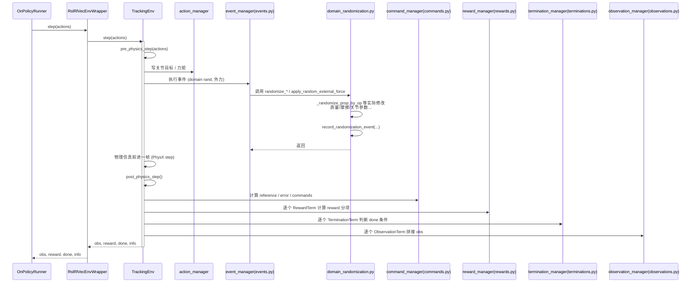

我用“训练脚本 → IsaacLab 环境 → MDP 各模块”这一条链路给你画两个流程图：

1. **整体调用流程**（从 `train_local.py` 到 `rewards/observations/...`）
2. **单步 step 内部的 MDP 流程**（重点标出 `commands / events / rewards / terminations / observations`，以及你自定义的 `domain_randomization.py`）

都用 Mermaid，你可以直接粘到仓库的 `docs/` 里，VSCode / GitHub 都能预览。

---

## 1️⃣ 整体调用流程（训练脚本视角）

```mermaid
flowchart TD
    subgraph Scripts
        A[train_local.py / train.py<br>解析 CLI 参数<br>加载 Hydra 配置]
    end

    subgraph IsaacLab App
        B[AppLauncher<br>启动 Isaac Sim 进程]
        C[hydra_main(...) 包装 main<br>加载 env_cfg / agent_cfg]
        D[创建 Tracking 环境实例<br>TrackingEnvCfg -> Env]
        E[RslRlVecEnvWrapper(env)]
    end

    subgraph RSL_RL
        F[OnPolicyRunner.learn()<br>训练循环]
        G[Policy π(·|obs)<br>actor-critic MLP]
        H[收集 rollouts<br>steps_per_env × num_envs]
        I[PPO.update()<br>计算 loss, 反向传播]
    end

    subgraph EnvInternals
        J[env.reset(env_ids)<br>场景构建 + 状态初始化]
        K[env.step(actions)<br>单次 step]
    end

    A --> B --> C --> D --> E
    E --> F
    F --> H
    H -->|"for t in horizon"| G
    G -->|"actions"| K
    J -->|"初始 obs"| F
    K -->|"obs, rew, done, info"| H
    F --> I --> F
```

**文字解释：**

* `train_local.py / train.py` 是入口：
  解析命令行 → 通过 Hydra 加载 `TrackingEnvCfg` + `rsl_rl_ppo_cfg`。
* `TrackingEnvCfg` 指向你的 tracking task（里面挂了 `commands.py / rewards.py / events.py / observations.py / terminations.py`）。
* 创建的 Env 被 `RslRlVecEnvWrapper` 包装后，交给 `OnPolicyRunner`。
* RSL-RL 的 `learn()` 里反复：

  * 用 policy π 预测动作 → 调用 `env.step(actions)`
  * 从 env 收 obs/reward/done → 填 buffer
  * 每个 iteration 调一次 `PPO.update()`。

---

## 2️⃣ 单步 env.step() 内部的 MDP 流程图（当前代码结构）

这一张重点是你 `tasks/tracking/mdp/` 下那几大文件，以及你自定义的 `domain_randomization.py` 的位置。

```mermaid
flowchart TD
    subgraph EnvStep
        S[env.step(actions)]
        S1[pre_physics_step(actions)]
        S2[物理仿真 step<br>PhysX / USD]
        S3[post_physics_step()]
    end

    subgraph Managers
        AM[action_manager<br>关节/力矩写入]
        CM[command_manager<br>commands.py]
        EM[event_manager<br>events.py<br>(domain randomization + 外力冲撞)]
        RM[reward_manager<br>rewards.py]
        OM[observation_manager<br>observations.py]
        TM[termination_manager<br>terminations.py]
    end

    subgraph DomainRandomization
        DR[domain_randomization.py<br>randomize_* 包装 + 日志]
        DRL[record_randomization_event()<br>写日志文件]
    end

    S --> S1 --> S2 --> S3

    %% pre_physics_step
    S1 --> AM
    S1 --> EM

    %% commands & events
    EM -->|"调用 base events:<br>randomize_mass / friction / gravity 等"| DR
    DR --> DRL

    %% post_physics_step
    S3 --> CM
    S3 --> RM
    S3 --> TM
    S3 --> OM

    %% 输出
    RM --> R[reward tensor]
    TM --> D[done mask]
    OM --> O[observation tensor]

    R --> S
    D --> S
    O --> S
```

### 具体调用顺序（更细一点）

可以再用一个时序图表示一帧 step：



---

## 3️⃣ 在这个流程里，各个 mdp 文件的职责位置

结合上面的图，你现在仓库里的 mdp 模块大致位置是：

* `commands.py`

  * 在 **post_physics_step 初期** 被调用：
    更新当前 step 的 reference pose / vel / error 等。
* `events.py`

  * 在 **pre_physics_step 或 reset** 时被 event_manager 调用：
    做 domain randomization（你现在的 `randomize_*` 都经 `domain_randomization.py` 包一层）、外力冲撞等。
* `rewards.py`

  * 在 **post_physics_step 中段** 被 reward_manager 调用：
    根据 `commands` 里的误差 / 当前状态计算各 reward 项。
* `observations.py`

  * 在 **post_physics_step 末尾** 被 observation_manager 调用：
    拼接出最终 obs 向量（包括 robot state、motion state、commands 等）。
* `terminations.py`

  * 在 **post_physics_step 中段** 与 rewards 并列：
    根据各种 error / 接触 / 时间判定 done mask。
* `domain_randomization.py`

  * 提供一组包装函数 + 日志接口：

    * 在 events 里把 `randomize_rigid_body_mass / randomize_joint_parameters / randomize_*` 重定向到这里
    * 在执行前后调用 `record_randomization_event`，写入 log 文件（你通过环境变量开关）。
